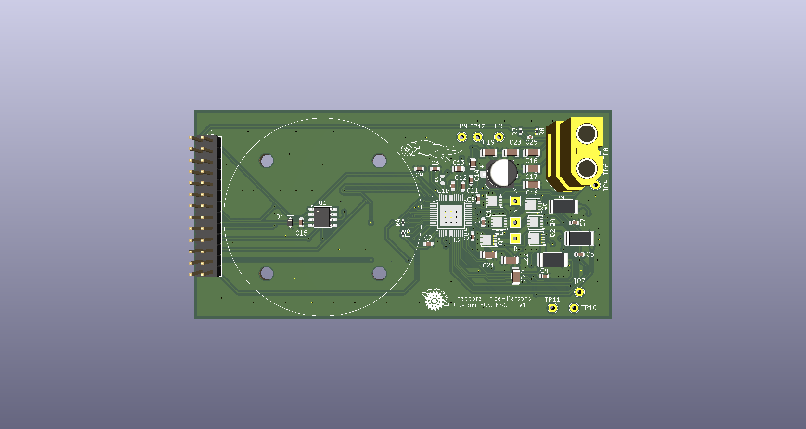

# Custom FOC ESC

Custom field-oriented-control motor controller.

## Structure
- `firmware/` — STM32G474 firmware (STM32CubeIDE project)
- `hardware/` — KiCad PCB design
- `mechanical/` — mounts and enclosure CAD

### 1. Electrical angle
 
The MT6701 measures the mechanical angle $\theta_m$. The control math uses the electrical angle, which moves $p$ (=number of poles) times per mechanical revolution:
 
$$
\theta_e = p\,(\theta_m - \theta_0) \bmod 2\pi
$$
 
$\theta_0$ --> encoder offset read by running current through phase A and seeing where it settles.
 
### 2. Clarke transform: $(a, b, c) \rightarrow (\alpha, \beta)$
 
The three phase currents are 120° apart and sum to zero ($i_a + i_b + i_c = 0$), so only two of them carry independent information. The Clarke transform projects them onto two orthogonal stationary axes. The amplitude-invariant form keeps a phase current of amplitude $I$ as a vector of magnitude $I$:
 
$$
\begin{bmatrix} i_\alpha \\ i_\beta \end{bmatrix}
= \frac{2}{3}
\begin{bmatrix} 1 & -\tfrac{1}{2} & -\tfrac{1}{2} \\[2pt] 0 & \tfrac{\sqrt{3}}{2} & -\tfrac{\sqrt{3}}{2} \end{bmatrix}
\begin{bmatrix} i_a \\ i_b \\ i_c \end{bmatrix}
$$
 
We use all three phasors, in order to average shunt measurement noise. 
 
### 3. Park transform: $(\alpha, \beta) \rightarrow (d, q)$
 
Rotating by $\theta_e$ moves into the rotor's reference frame. In steady state, the sinusoidal currents become **constants**:
 
$$
\begin{bmatrix} i_d \\ i_q \end{bmatrix}
=
\begin{bmatrix} \cos\theta_e & \sin\theta_e \\ -\sin\theta_e & \cos\theta_e \end{bmatrix}
\begin{bmatrix} i_\alpha \\ i_\beta \end{bmatrix}
$$
 
- $i_d$: current aligned with the rotor magnets. It produces no torque and is regulated to 0.
- $i_q$: current perpendicular to the rotor magnets. Torque is $\tau = k_t\, i_q$.
The inverse Park transform is the transpose of the same rotation matrix:
 
$$
\begin{bmatrix} v_\alpha \\ v_\beta \end{bmatrix}
=
\begin{bmatrix} \cos\theta_e & -\sin\theta_e \\ \sin\theta_e & \cos\theta_e \end{bmatrix}
\begin{bmatrix} v_d \\ v_q \end{bmatrix}
$$
 
### 4. Plant model
 
In the rotor frame, each axis is an RL circuit with coupling and back-EMF terms ($\omega_e$ = electrical speed, $\lambda$ = magnet flux linkage):
 
$$
v_d = R\,i_d + L\frac{di_d}{dt} - \omega_e L\, i_q
$$
 
$$
v_q = R\,i_q + L\frac{di_q}{dt} + \omega_e L\, i_d + \omega_e \lambda
$$
 
The $\omega_e$ terms vary slowly compared to the current loop, so they are treated as disturbances that the integrator rejects. Taking the Laplace transform with zero initial conditions gives the plant for each axis:
 
$$
G(s) = \frac{I(s)}{V(s)} = \frac{1}{Ls + R}
$$
 
This is a single real pole at $s = -R/L$, i.e. the electrical time constant $\tau_e = L/R$.
 
### 5. PI current controller (continuous design)
 
$$
C(s) = K_p + \frac{K_i}{s} = K_p\,\frac{s + K_i/K_p}{s}
$$
 
The open-loop transfer function is
 
$$
C(s)\,G(s) = \frac{K_p}{L}\cdot\frac{s + K_i/K_p}{s\,(s + R/L)}
$$
 
Choose $K_i / K_p = R/L$ so that the controller zero cancels the plant pole:
 
$$
C(s)\,G(s) = \frac{K_p}{L\,s}
\quad\Longrightarrow\quad
T(s) = \frac{C G}{1 + C G} = \frac{\omega_c}{s + \omega_c}, \qquad \omega_c = \frac{K_p}{L}
$$
 
The closed loop is first-order with bandwidth $\omega_c$, so a step in the current reference produces no overshoot:
 
$$
i(t) = i_{ref}\left(1 - e^{-\omega_c t}\right)
$$
 
$$
\boxed{K_p = \omega_c L, \qquad K_i = \omega_c R}
$$
 
By the final value theorem, the integrator drives steady-state error to zero for a constant reference. This is why the control is done in the dq frame, where the references are DC.
 
**Choosing $\omega_c$.** The bandwidth must stay well below the loop rate $f_s$. A typical choice is $f_c \le f_s / 20$. If $R$ or $L$ is mismatched, the cancellation is imperfect, which causes mild overshoot or a slow tail. The loop stays stable for any positive gains.
 
**Measuring $L$.** Apply a voltage step $V$ to one phase pair. Taking the inverse Laplace transform of $\frac{V}{s(Ls+R)}$ gives
 
$$
i(t) = \frac{V}{R}\left(1 - e^{-tR/L}\right)
$$
 
so the time to reach 63.2% of the final current is $\tau_e = L/R$.
 
### 6. Discrete PI with anti-windup
 
The controller runs at a fixed period $T_s$. The integrator $1/s$ is discretized with forward Euler, $\frac{1}{s} \approx \frac{T_s}{z - 1}$:
 
$$
e[k] = i_{ref}[k] - i[k]
$$
 
$$
v[k] = K_p\, e[k] + x[k]
$$
 
$$
x[k+1] = x[k] + K_i T_s\, e[k]
$$
 
The output voltage vector is limited by what the inverter can produce (see §7):
 
$$
\sqrt{v_d^2 + v_q^2} \le V_{max} = k_{max}\,\frac{V_{bus}}{\sqrt{3}}, \qquad k_{max} \approx 0.9
$$
 
When the output saturates, the integrator update is skipped (conditional integration). This prevents windup at high speed, where back-EMF consumes the available voltage.
 
### 7. Space-vector modulation
 
The motor's star point floats, so it only responds to **differences** between phase voltages. Adding the same common-mode offset $v_{cm}$ to all three phases changes nothing the motor sees, but it can re-center the duties to use the full bus.
 
With inverse Clarke:
 
$$
v_a = v_\alpha, \qquad
v_b = -\tfrac{1}{2}v_\alpha + \tfrac{\sqrt{3}}{2}v_\beta, \qquad
v_c = -\tfrac{1}{2}v_\alpha - \tfrac{\sqrt{3}}{2}v_\beta
$$
 
the common-mode offset is
 
$$
v_{cm} = \frac{\max(v_a, v_b, v_c) + \min(v_a, v_b, v_c)}{2}
$$
 
and the duty for each phase $x \in \{a, b, c\}$ is
 
$$
d_x = \frac{1}{2} + \frac{v_x - v_{cm}}{V_{bus}}
$$
 
This min/max injection is mathematically equivalent to symmetric (7-segment) SVPWM. It raises the maximum line-to-line voltage from $\frac{\sqrt{3}}{2}V_{bus}$ (sine PWM) to $V_{bus}$, about 15.5% more, so the maximum phase-vector magnitude is $V_{bus}/\sqrt{3}$.
 
$k_{max} < 1$ keeps every phase low for part of each period, so the low-side shunt current can be sampled at the PWM center.
 
### 8. Parameters
 
| Symbol | Meaning | Value |
|---|---|---|
| $R$ | Phase resistance | TBD (measured) |
| $L$ | Phase inductance | TBD (step test) |
| $p$ | Pole pairs | TBD (count magnets / 2) |
| $\theta_0$ | Encoder offset | Calibrated at startup |
| $f_s$ | Control loop rate | ≈ 10.38 kHz |
| $f_c$ | Current loop bandwidth | TBD (≤ $f_s/20$) |
| $k_{max}$ | Modulation limit | 0.9 |