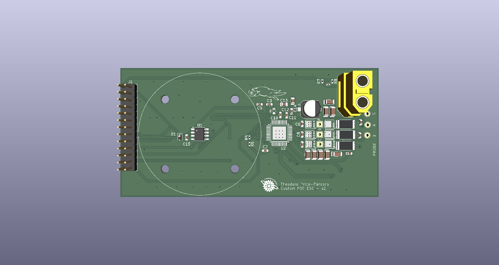
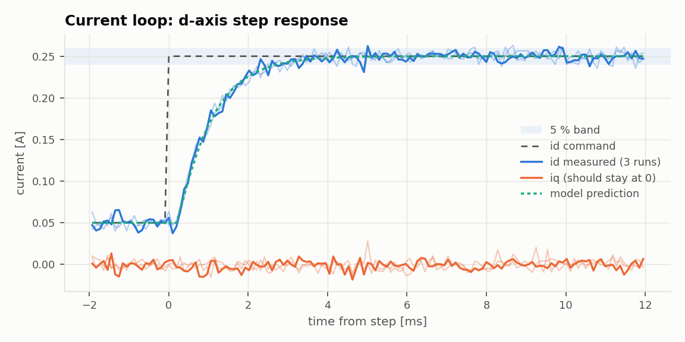
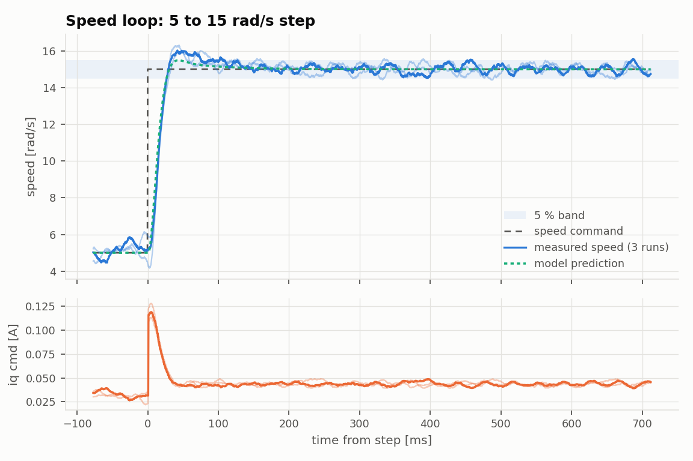
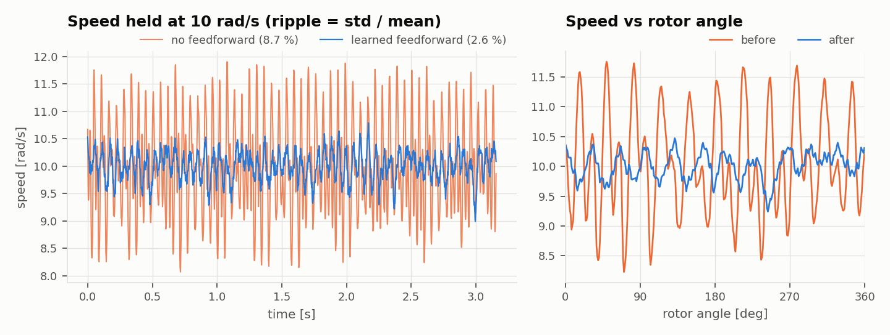
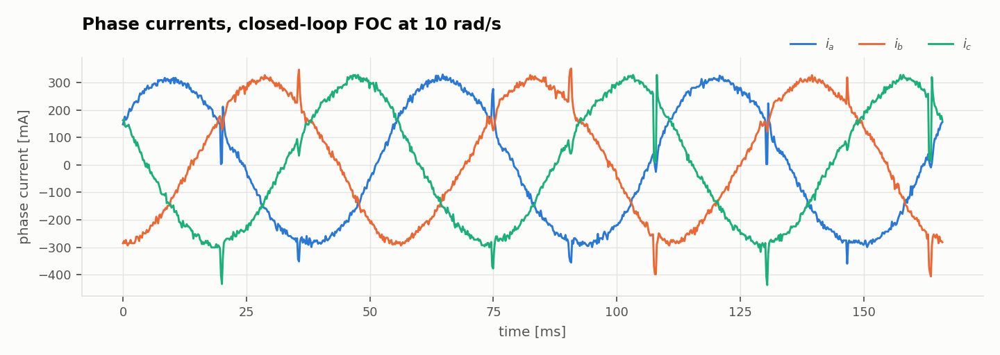

# Custom FOC ESC

A field-oriented-control motor controller designed from scratch: a 4-layer power board, STM32G474 firmware with cascaded current and speed loops, and an automated hardware-in-the-loop test bench that verifies the drive against written requirements.


https://github.com/user-attachments/assets/c9957159-f915-4ab0-a1e7-d9c9039c102c


*First closed-loop FOC spin (Oct 2026); kept for sentimental value.*



## Highlights

- **Hardware:** DRV8305 gate driver, AON7544 MOSFETs, 5 mΩ low-side shunts on all three phases, MT6701 magnetic encoder, 4-layer stackup with dedicated ground and power planes.
- **Firmware:** sensored FOC at 10.4 kHz on the STM32G474's high-resolution timer, min/max SVPWM, PI current loops with conditional-integration anti-windup, and an outer speed loop, and a learned cogging feedforward. Worst-case ISR load is about 50 % of the cycle budget.
- **Verification:** one command runs every test on the hardware, identifies the motor (R, L, Kt, J), predicts each result from those parameters, and reports predicted vs measured with pass/fail per requirement.
- **Safety:** host watchdog in the control ISR, latched E-stop, overcurrent and gate-driver fault trips.
- **Cogging compensation:** the leftover speed ripple was traced to cogging torque from its harmonics (11, 22 and 24 per revolution: pole pairs, poles, slots). The bench learns a feedforward in 4 to 5 iterations and cuts ripple from about 8 % to 2.4 %.

## Test results

<!-- bench:start -->

**10 / 12 requirements passed** on 2026-11-20 17:19 (firmware `a3aba97-dirty`, 12.0 V bus, N = 3 runs per test, cogging feedforward learned in-run). [Full test report](bench/results/2026-11-20_171617/report.md)

| ID | Requirement | Limit | Predicted | Measured | Result |
|---|---|---|---|---|---|
| REQ-CUR-01 | Current loop rise time (10-90 %) | < 2.5 ms | 1.85 ms | 1.83 ± 0.041 ms | ✅ PASS |
| REQ-CUR-02 | Current loop overshoot | < 10 % | ≈ 0 % | 4.52 ± 0.96 % | ✅ PASS |
| REQ-CUR-03 | Current loop settling time (5 % band) | < 4 ms | 2.79 ms | 6.49 ± 6.1 ms | ❌ FAIL |
| REQ-CUR-04 | d/q decoupling: peak q-axis error during a d-axis step | < 20 % of step | ≈ 0 % of step | 5.54 ± 1.1 % of step | ✅ PASS |
| REQ-CUR-05 | Current steady-state noise (std of id, 20 ms after the step onward) | < 10 mA | – | 5.64 ± 0.08 mA | ✅ PASS |
| REQ-SPD-01 | Speed step overshoot (5 to 15 rad/s) | < 20 % | 4.87 % | 10.5 ± 1.8 % | ✅ PASS |
| REQ-SPD-02 | Speed step settling time (5 % band) | < 300 ms | 27 ms | 313 ± 1.9e+02 ms | ❌ FAIL |
| REQ-SPD-03 | Speed steady-state error | < 2 % | ≈ 0 % | 0.232 ± 0.15 % | ✅ PASS |
| REQ-SPD-04 | Speed ripple at 10 rad/s (std / mean) | < 5 % | – | 2.38 ± 0.46 % | ✅ PASS |
| REQ-ENC-01 | Encoder read glitches during slow open-loop rotation (jump > 20 counts) | < 0.1 per s | – | 0 per s | ✅ PASS |
| REQ-SYS-01 | Control ISR worst-case CPU load | < 60 % | – | 50.2 % | ✅ PASS |
| REQ-SAF-01 | Host watchdog disables the drive on link loss | yes | – | yes | ✅ PASS |

<p>
  
  
</p>





<!-- bench:end -->
**Figures**

- **Current loop step:** d-axis current step 0.05 to 0.25 A with the rotor free; measured rise 1.83 ms against 1.85 ms predicted from the measured R and L.
- **Speed loop step:** 5 to 15 rad/s with the cogging feedforward on, against the model prediction from the measured Kt and J.
- **Cogging feedforward:** speed held at 10 rad/s before and after learning. The left plot is speed over time; the right plot is speed against rotor angle, where the 22 bumps per revolution (one per magnet pole) disappear.
- **Phase currents:** 10 rad/s with 0.3 A injected on the d-axis (no torque) so the waveform sits well above the 4 mA ADC step. Amplitudes match within about 1 % and the phases sit 120 ± 0.3° apart. The spikes are corrupted current samples, not real current (see Known issues).

**Known issues**

- **REQ-CUR-03:** about 1 in 3 current steps shows a disturbance after the rotor starts moving; the other runs settle in 2.8 to 3.1 ms, matching the 2.79 ms prediction. Root cause open.
- **REQ-SPD-02:** the transient settles in about 100 ms, but the remaining speed ripple can push the speed outside the ±0.5 rad/s (5 %) band late in the record.
- **Phase current spikes:** at fixed electrical angles, three per electrical cycle, the three phase currents briefly stop summing to zero (by up to 0.4 A). Phase C, sampled last by the ADC, is worst. Suspected cause: ADC sampling-window timing at certain duty combinations. Under investigation; this may also explain the two items above.

## How it works

```
 NUCLEO-G474RE                                        ESC board                    GM4108H motor
 ┌──────────────────────────────────────────┐        ┌─────────────────────┐
 │ HRTIM ── 3 x PWM (center-aligned) ───────┼──────▶ │ DRV8305 → 3 half-   │ ───▶ phases A/B/C
 │   └─ ADC trigger at PWM center           │        │ bridges (AON7544)   │
 │ ADC1 + DMA ◀── 3 shunt amplifiers ───────┼─────── │ 5 mΩ shunts, 40 V/V │
 │ SPI3 (shared bus) ◀──────────────────────┼─────── │ DRV8305 config/stat │
 │                  ◀──────────────────────┼─────── │ MT6701 encoder (SSI)│ ◀── magnet on rotor
 │ foc_isr() @ 10.38 kHz                    │        └─────────────────────┘
 │ LPUART1 ◀──▶ test bench (PC)            │
 └──────────────────────────────────────────┘
```

Each control period:

1. The HRTIM triggers the ADC at the PWM center, when all low-side switches are on and the shunts carry the phase currents.
2. The ISR reads the encoder, converts the mechanical angle to the electrical angle, and transforms the phase currents into the rotor frame (Clarke, then Park), where they are DC.
3. Two PI controllers regulate $i_d$ to 0 and $i_q$ to the torque command. Every 10th tick the speed PI sets the $i_q$ command.
4. The voltage command is transformed back (inverse Park) and turned into three duty cycles with min/max SVPWM, which reaches the full $V_{bus}/\sqrt{3}$ phase voltage.

The derivations, including the PI design by pole-zero cancellation, the speed loop design and the expected step responses, are in [docs/control-math.md](docs/control-math.md).

## Test bench

The bench (in [`bench/`](bench/)) drives the ESC over UART from Python:


- The firmware injects each step at an exact control-loop sample and records 2048 samples to RAM; the PC downloads the capture and computes every metric from it.
- It measures R and L from a d-axis voltage step and predicts the current-loop response from them (150 Hz design bandwidth; `--tune-current` computes and loads new gains from the measured R and L).
- It learns the cogging feedforward at 10 rad/s, then measures ripple and the speed step with it on.
- Each result is predicted from the parameters measured in the same run, so the report checks the design math as well as the hardware.
- Requirements have IDs and limits in [`bench/spec.py`](bench/spec.py); each test runs N times and reports mean ± std.
- The unmodified firmware also runs on the PC against a motor model (SIL, `--sil`; `--hw-like` adds the cogging measured on the real motor), and the metric code has unit tests.

Details: [bench/README.md](bench/README.md), wire protocol: [bench/PROTOCOL.md](bench/PROTOCOL.md).

## Hardware

| | |
|---|---|
| Gate driver | TI DRV8305, 3-PWM mode, SPI configuration, integrated current-sense amplifiers (40 V/V) |
| Power stage | AON7544 N-channel MOSFETs, 3 half-bridges |
| Current sensing | 5 mΩ low-side shunts on all three phases (±8 A sense range), sampled at PWM center |
| Position | MT6701 14-bit magnetic encoder over SSI, sharing one SPI bus with the DRV8305 |
| Stackup | 4 layers: power stage, solid ground, PVDD plane, signals |
| Power | 3S LiPo (12 V), XT60; 2 mm bullet connectors for swappable motor leads |
| Controller | NUCLEO-G474RE (Cortex-M4F, 170 MHz) |
| Motor | GM4108H-120T gimbal motor, 11 pole pairs |

KiCad projects are in `hardware/` and motor mounts in `mechanical/`.

## Bring-up notes

Four wiring and configuration mistakes took most of the bring-up time:

1. The board ground was on the bench supply's earth terminal, so PVDD was never powered. The Nucleo back-fed 3.3 V into the DRV8305's regulator pin, which made PWRGD look healthy while SPI read all zeros.
2. The nFAULT jumper was on the wrong Nucleo pin, so the MCU read a floating input.
3. PWM went to the INL inputs; in 3-PWM mode the DRV8305 ignores INL, so every low-side gate sat on.
4. One ADC pin on the Nucleo gave a large drifting offset. Swapping channels proved the board signal was clean, and moving phase C to another pin fixed it.

## Repository

| Folder | Contents |
|---|---|
| `firmware/` | STM32CubeIDE project. Control code in `App/foc/`, drivers in `App/drivers/`, bench interface in `App/bench/` |
| `hardware/` | KiCad projects for each board revision |
| `mechanical/` | Motor and encoder mounts (STEP) |
| `bench/` | Automated test bench, requirements, reports |
| `docs/` | Control math and figures |

